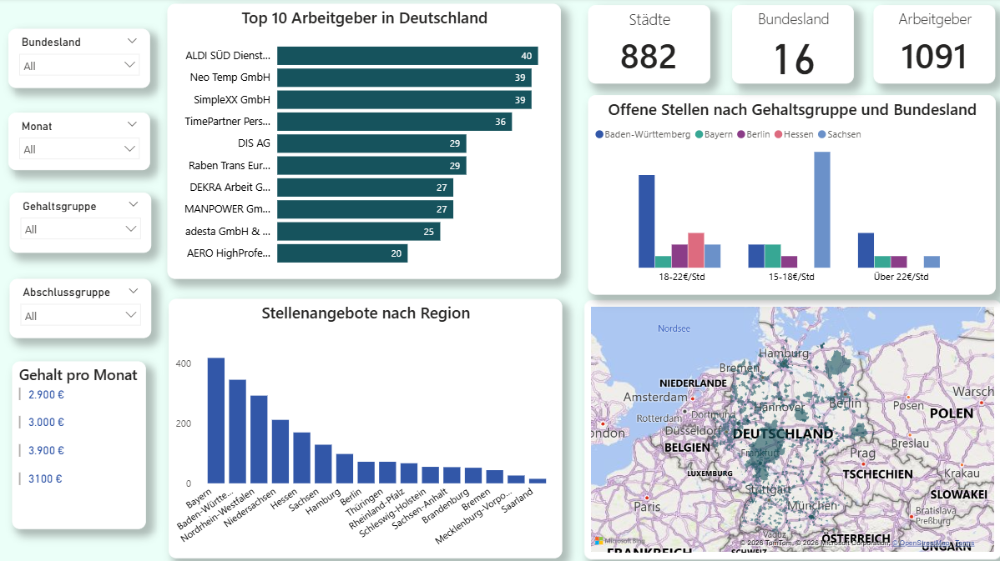
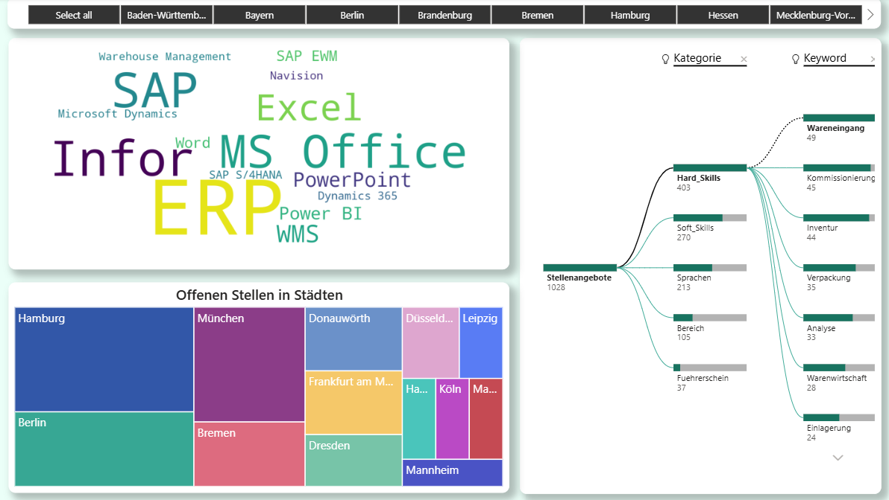
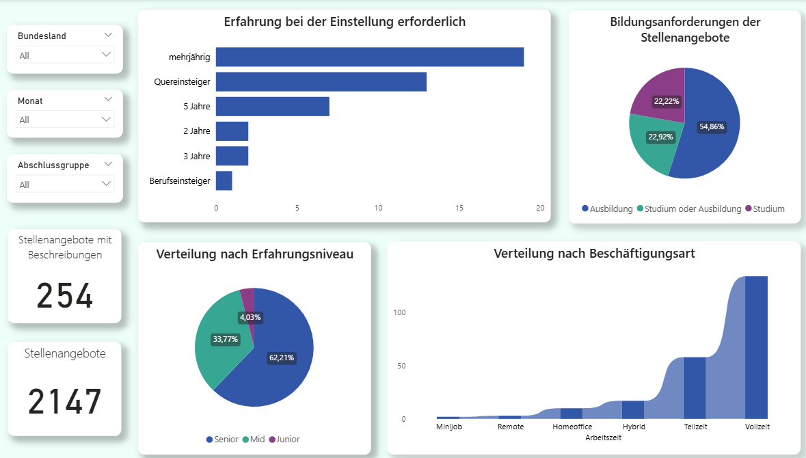
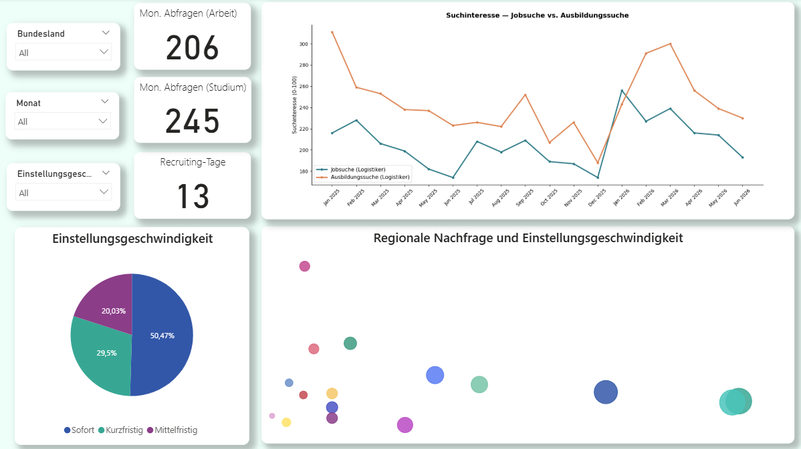

# German Logistics Labor Market Analysis | Power BI | Python | Web Scraping

As part of my Data Analytics programme at ITCareerHub, I developed an end-to-end analytics project exploring the German logistics job market.

Using Python, the Arbeitsagentur.de API, web scraping, Google Trends, and Power BI, I analyzed 2,147 logistics job postings published between April 1 and June 22, 2026 to identify hiring demand, required skills, regional distribution, and potential labor shortages.

## 🎯 Business Goal

The objective was to analyze the German logistics labor market by answering questions such as:

* Where are logistics professionals most in demand?
* Which employers are hiring the most?
* Which skills and qualifications are most frequently requested?
* What employment conditions are offered?
* How does employer demand compare with candidate search interest?

## 📊 Dashboard Overview

### 🗺️ Dashboard 1 — Job Market Overview

* KPI cards: Cities, Federal States, Employers
* Top 10 employers by number of vacancies
* Job postings by Bundesland
* Salary distribution by region
* Interactive map of vacancy density across Germany

Filters: Bundesland • Month • Salary Group • Education Level

### 🧩 Dashboard 2 — Skills Analysis

* Word Cloud of the most requested tools and software (SAP, ERP, MS Office, Power BI, WMS)
* Hierarchical breakdown of:
  * Hard Skills
  * Soft Skills
  * Languages
  * Education
  * Driving License
* Treemap of vacancies by city

### 📋 Dashboard 3 — Requirements & Employment Conditions

* Required experience levels
* Education requirements
* Seniority distribution
* Employment types
* KPI cards for total vacancies and detailed job descriptions

### 🔄 Dashboard 4 — Demand vs. Candidate Interest

This dashboard combines labor market data with Google Trends to compare employer demand and candidate search behaviour. It includes:

* Search interest over time
* Hiring urgency
* Regional demand vs. hiring speed
* Monthly search KPIs
* Average recruiting time

## ⚙️ Technical Highlights

* Python data collection via the Arbeitsagentur.de API
* Web scraping of job descriptions with access restriction handling
* Data cleaning:
  * duplicate removal
  * date normalization
  * salary normalization
  * experience-level classification
* Dictionary-based extraction of:
  * Hard Skills
  * Soft Skills
  * Software & Tools
  * Languages
  * Education
  * Salary
* Google Trends integration
* Relational Power BI data model
* Custom calendar table
* DAX measures for KPIs, salary ranges and skill frequency

## 💡 Key Insight

The analysis suggests a mismatch between employer demand and candidate search interest, indicating potential labor shortages for logistics positions in Germany.

Most vacancies require 2–5 years of experience, while a university degree is often not mandatory, making logistics an attractive career path for professionals with relevant training or transferable skills.

## 🚀 What I Learned

The most interesting part of this project was combining job market data with Google Trends to move beyond descriptive analytics and explore the relationship between employer demand and candidate interest.

Aligning data from multiple sources by date, category, and region required several iterations, but it resulted in a more meaningful and business-oriented analysis.

I'd be happy if you explored the dashboard and shared your feedback.

## 📂 Project Files

* [Power BI Dashboard (.pbix)](power_bi/dashboard.pbix)
* [Open in Google Colab](ссылка_на_colab) — run interactively
* [View Notebook (.ipynb)](notebooks/analysis.ipynb) — static view on GitHub
